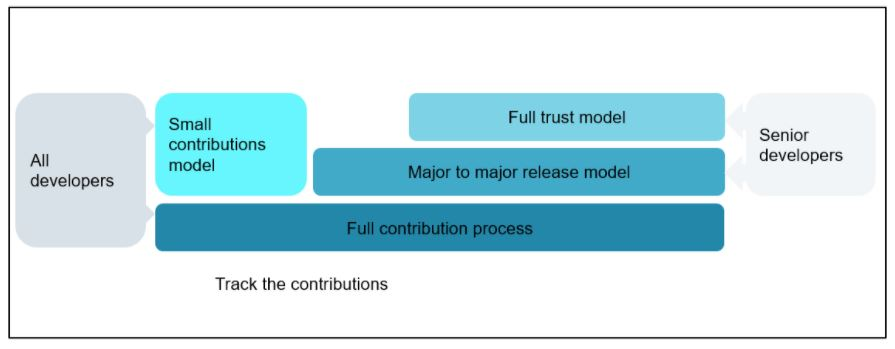
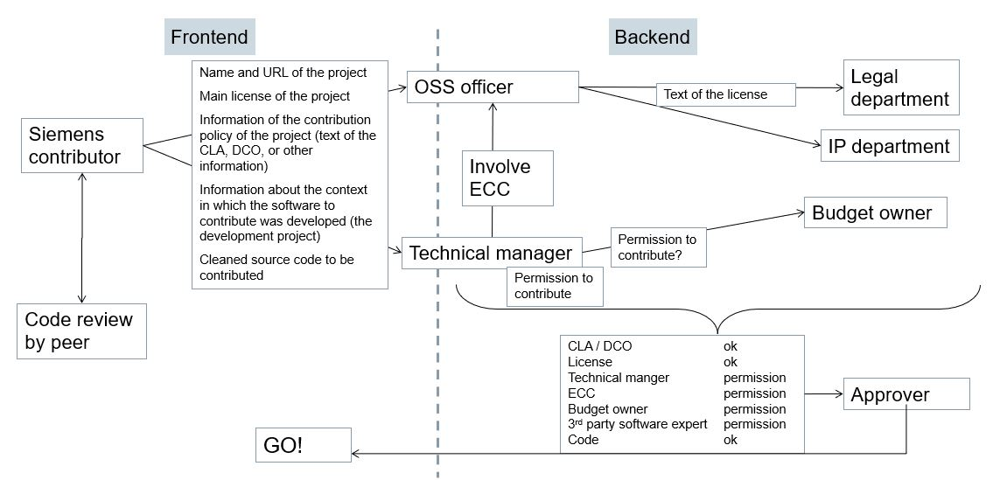

# Contributing to existing open source projects

## Why contribute to open source projects?

TODO

## How to contribute to open source projects

TODO

### Governance and contribution models

The following approaches are suited for such developers:

* small contributions model
* major to major release model
* full trust model

#### Small contributions Model or trivial contributions

A small or trivial contribution is a rather small and simple change to already existing open source software. Typical cases found in this category are bug fixes and error corrections with no or low Intellectual Property value.
A change is not trivial if:

* Functionality is added or changed.
* The interface of the open source software component is changed.
* It is an optimization that more than insignificantly increases performance.
* It contains a design or an algorithm that wouldn’t be obvious for a software engineer.

This procedure scopes small contributions. It can be followed for small or trivial contributions following the initial contribution to a particular OSS project or component. The initial contribution has to implement the entire procedure described above, because CLAs / DCOs etc. have to be checked  and signed in case the particular project requires them.
After the initial contribution all subsequent small contributions can be contributed directly to the OSS project without the need to follow the defined process no matter which version of the OSS project.

#### Major to major release model

This procedure scopes the release cycle of the OSS project where contributions shall be made to. It has the same “starting point” like any other contribution - the initial contribution has to implement the entire procedure in order to check CLAs / DCOs and to have the documented permission to contribute to a specific project. After the initial contribution all subsequent contributions during the development of a new major release can be contributed to the OSS project without the need to go through the approval process. There is no size limitation for contributions. The contributions can range from a trivial bug fix to adding new features, changing interfaces, refactoring and so on. After the release of a major version of the project a new approval procedure has to be kicked off for the first contribution after the major release.

#### Full trust model

The full trust model can be applied to developers who have already successfully worked under the major to major release model. It is an incentive for the employee and a sign of confidence of the employer towards the employee. Basically it is the allowance for the developer to work “upstream” without any approval procedure. Since this model shall only be applied after the developer worked successfully under the major to major release model, there is no need for an  “initial” contribution with the entire approval procedure, although it makes sense in order to have it documented.

The Major to major release model as well as the full trust model shall only be executed by  senior developers, who are specially trained in copyright principles, have a good understanding of the business interests of the company they are working for, practise “an ownership culture” and have already deep experience in the open source ecosystem.
In order to track all the contributions the developers shall contribute with their official email / github id.

#### Clearing projects for contributions

Another model is to provide approval for specific projects. These projects are checked, e.g. by the OSPO, and if everything is in place to allow contributions, they are cleared for contributions by employees. Then there is no individual approval for each specific contribution required, but only if general conditions of the project change, such as license or introduction of a CLA, etc.

Prerequisite for such a model is that contributors are qualified to do contributions autonomously. This can be achieved by making sure contributors have received training and/or tracking and approving who can contribute to which repository.

### Trainings

Contributors to open source projects will need to act with a certain degree of autonomy to be effective. For some corporate software developers it will also be new to participate in open source communities. For these reasons it's important to support corporate contributors and provide them with training or similar means to develop the understanding and skills to act as good citizens of the open source world on behalf of your company.

This can be achieved with mentoring, good practice guides, or trainings which cover the following topics:

* Essentials of legal implications of open source, such as copyright, licensing, CLAs, DCOs, trademarks
* Awareness of your corporate rules and policies for contributing to open source
* Open source community culture
* Typical open source development procedures
* Open source governance in its different forms such as foundations or single-vendor projects
* Working in public
* Dealing with conflict of interests between open source project and company
* Where to get internal support in case of doubt or questions

### Example: Approval process for contributions to open source projects (Siemens)

#### Guiding principles

The procedure described in the following is designed to ensure that the company interests and its employees are protected. We also need to make sure that contributions are in line with copyright law, export regulations, data protection regulations and open source development best practices. On the other hand, procedural burden for all to be involved stakeholders should be low and the approval procedure should not take too much time.

#### Responsibility: decision rests with unit

* The approval procedure is the responsibility of the organizational unit that paid for the development of the code in question
* If the affected code/IP is used, co-developed or co-financed by other Units, involve them as stakeholders in the release decision

#### General structure and scope of the process

##### Lean procedure

* The tasks to be carried out by the developer should be clear, simple, and cause as little effort as possible
* The potential complexity of the “backend tasks” should not be visible to the developer. The current status of the request shall be visible to the developer

##### Boundary conditions

* Protect our employees and our business interests
* Act in compliance with law, internal and external regulations
* Provide transparency to the decision makers on what and how much of the companies code and IP will be affected by the publication
* All the contributions shall be made with the “company”-email (similar for the github activity) so that all contributions of the company can be identified easily.
* Respect the rules and customs of the OSS ecosystem and of the target OSS project

#### Process for expressing company approval for contributions

##### Why is it needed?

Why is there a need for a certain procedure at all? First of all the copyright law requires it.

For example the German copyright act states in Section 69b ([Source](https://www.gesetze-im-internet.de/englisch_urhg/englisch_urhg.html#p0522)):

    Authors in employment or service relationships
    (1) Where a computer program is created by an employee in the execution of his duties or following the instructions of his employer, the employer exclusively shall be entitled to exercise all economic rights in the computer program, unless otherwise agreed.

This means that all the software developed in this context is the property of the employer i.e. the company the developer is working for. At least the German copyright act does not limit the proprietorship to code developed during working hours or within the company IT infrastructure, it only scopes the context.

Secondly a procedure is required to protect the companies business interests as well as to protect the employee. Last but not least public code is like the business card of a company as well as of the developer who has written the code.

The more complex the business environment in which the code to publish was developed, the more stakeholders need to be involved. The picture below shows a procedure that involves all functions, even in a complex setup.

##### Outbound CLA

TODO: See [issue #3](https://github.com/Open-Source-Compliance/outbound-oss/issues/3).

##### Procedure for contributions to existing projects

An example for a full process for doing contributions looks like this:

The procedure described above is not suited for frequent contributors and/or contributors who are working “upstream” in their daily work. For these developers different procedures need to be established in order to avoid loading them with “unproductive” work. This is described in the section about contribution models.

## Build an open source metrics strategy when contributing to open source projects

TODO

### Goal-question-metric approach

TODO

## Spare time contributions

TODO: See [issue #2](https://github.com/Open-Source-Compliance/outbound-oss/issues/2).
