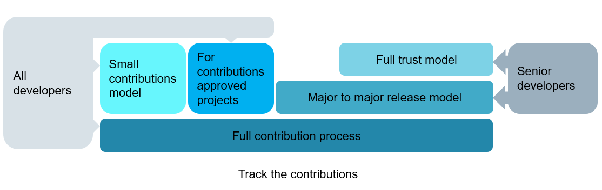

# How to contribute to open source projects

Building better relationships with the open source ecosystem has its own set of challenges, but it becomes easier if you have a clear plan to follow. Here are some guidelines to a number of practices that organizations can adopt.

## Define your open source goal and strategy

Your open source strategy connects the plans for managing, participating in, and creating open source software with the business objectives that the plans serve. This can open up many opportunities and catalyze innovation. The TODO Group offers a dedicated guide to [Setting an Open Source Strategy](https://todogroup.org/guides/strategy/)

## Establish open source guiding principles and processes

### Guiding principles

The procedure described in the following is designed to ensure that the company interests and its employees are protected. We also need to make sure that contributions are in line with copyright law, export regulations, data protection regulations and open source development best practices. On the other hand, the procedural burden for all to be involved stakeholders shall be low and the approval procedure should not take too much time.

### Responsibility: decision rests with unit

* The approval procedure is the responsibility of the organization that financed the development of the code in question
* If the affected code/IP is used, co-developed or co-financed by other units, involve them as stakeholders in the release decision

### General structure and scope of the process

#### Lean procedure

* The tasks to be carried out by the developers should be clear, simple, and cause as little effort as possible
* The potential complexity of the “backend tasks” should not be visible to the developer. The current status of the request shall be visible to the developers

#### Boundary conditions

* Protect our employees and our business interests
* Act in compliance with law as well as with internal and external regulations
* Provide transparency to the decision makers on what and how much of the companies' code and IP will be affected by the publication
* The contributions shall not harm the business strategy of other parts of the company
* All the contributions shall be made with the “company” e-mail (similar for the GitHub activity) so that all contributions of the company can be identified easily
* Respect the rules and customs of the OSS ecosystem and of the target OSS project

### Process for expressing company approval for contributions

#### Why is it needed?

Why is there a need for a certain procedure at all?

First of all, the copyright law requires it.

For example, the German copyright act states in Section 69b:
Authors in employment or service relationships
> (1) Where a computer program is created by employees in the execution of their duties or following the instructions of their employer, the employers exclusively shall be entitled to exercise all economic rights in the computer program, unless otherwise agreed.

Source: [German Copyright Act](https://dejure.org/gesetze/UrhG/69b.html)

This means that all the software developed in this context is the property of the employers - i.e., the company the developers are working for. At least the German copyright act does not limit the proprietorship to code developed during working hours or within the company IT infrastructure, it only scopes the context.

Secondly, a procedure is required to protect the company’s business interests as well as to protect the employees. In the context of contributions several aspects can harm the business interests of a company, like (the following list is not a complete list):

* Accidently contributing intellectual property, which shall not leave the company (core IP)
* Contributing code which is not anymore state of the art
* Accidently contributing company internal credentials or other sensible data like personal data

Similar to the protection of business interests, the protection of the employees has several aspects:

* Employees who contribute material, which was created in the scope of Section 69b without an official approval, may be hold liable for any negative consequences to the company or face repercussions in context of their work contract
* Contributions which are not inline with the projects' rules and practices, might harm the employees reputation

Finally, public code is like the business card of a company as well as of the developers who have written the code.

#### Outbound CLA

Some open source projects as well as some open source foundations require a Contributor License Agreement (CLA) before they accept contributions. We know at least two different types of CLAs:

* Corporate Contributor License Agreement (CCLA)
* Individual Contributor License Agreement (ICLA)

Whether none, one or both are required for contributions is usually described in files like `CONTRIBUTING.md` in the project repositories. The [CCLA](https://www.apache.org/licenses/cla-corporate.pdf) and the [ICLA](https://www.apache.org/licenses/icla.pdf) authored by the Apache Foundation are the de facto standard of CLAs and many open source projects have adopted either one or both.

The purpose of a CLA is to provide confidence to the open source project that the contributor is entitled to submit the contribution. A Developer Certificate of Origin (DCO) is an alternative approach and more lightweight compared to a CLA.

Some CLAs also require to transfer additional rights to the project such as the right to release the code under an additional, often proprietary license. This is an asymmetric setup which puts contributors at a disadvantage. Therefore most companies will not contribute to these kind of projects.

The price of improved confidence for the open source project is more overhead in the organization the contributor is working for. Especially in case of large corporations with several affiliates the effort of evaluating, signing and maintaining a CCLA shall not be underestimated.

Why is a CCLA causing additional effort in large organizations? Let's briefly look at the CCLA of the Apache Foundation as an example:

* The CCLA is a contract - in many organizations the "four eyes principle" is implemented - a contract has to be signed by two persons, who have the right to sign contracts in the name of the organization - the required involvement of probably two more stakeholders requires additional effort in briefing them
* Usually a CCLA covers not only the specific legal entity the contributor is working for, it also covers all affiliates:
    > For legal entities, the entity making a Contribution and all other entities that control, are controlled by, or are under common control with that entity are considered to be a single Contributor. For the purposes of this definition, "control" means (i) the power, direct or indirect, to cause the direction or management of such entity, whether by contract or otherwise, or (ii) ownership of fifty percent (50%) or more of the outstanding shares, or (iii) beneficial ownership of such entity
* The CCLA includes besides the copyright grant a patent grant. This is fine, nevertheless inside the organization the "IP department" needs to be involved in the evaluation process of the CCLA and for the specific contribution the "IP department" need to sync with all affiliates
* The CCLA needs to be analyzed by the "Legal department" of the organization.

Some CCLAs require that the copyright of the contributions are assigned to the open source project/foundation. Copyright assignment is a topic which causes even more effort and might not be accepted at all.

Besides the above-mentioned additional effort the CCLA adds additional "maintenance effort" to the organization, because it requires that the organization nominates all entitled contributors by name to the CCLA requiring party.
> It is your responsibility to notify the Foundation when any change is required to the list of designated employees authorized to submit Contributions on behalf of the Corporation, or to the Corporation's Point of Contact with the Foundation.

* The signed CCLA has to be made available inside the organization - This can be done via publishing the CCLA on the OSPOs website at a location which can be found easily be the employees (e.g., it might be useful to have a "top level page" named CCLAs, this page then contains a list of "signed CCLAs", a list of "CCLAs under evaluation", and a list of "denied CCLAs".)

* All affiliates need to be informed and a procedure needs to be defined how the affiliates can nominate/de-nominate contributors working for them. This becomes even more challenging in case an affiliate has no access to the intranet of the signing entity. In this case the signed CCLA or the information about the signed CCLA needs to be sent to the OSPOs of all affiliates, in case an affiliate has no OSPO set up, the information must be routed to the function, which is in charge of software development. All affiliates need to provide the names of nominated contributors or former contributors, who shall not be entitled anymore to do contributions to the OSPO of the signing entity, which then must inform the Foundation/project about the change of the list of contributors.
* Publishing the list of contributors inside the organization and disclosing it to the Foundation/project might also require the approval of the data protection officers of the involved entities

This additional effort may hold organizations off to contribute small bug fixes or patches or even new features to the upstream open source projects and puts them to risk of private forks and thus a lot of additional development effort in the long run. Thus the decision not to contribute needs to be taken very carefully.

A DCO in contrast to a CLA is a much more lightweight procedure. It was introduced to enhance the confidence that contributions to the Linux kernel are made "legally correct" by the contributors. The [DCO version 1.1](https://developercertificate.org/) is used by many open source projects.

The main difference of a DCO compared to a CLA is, that a DCO is not a contract, it is a kind of attest of the specific contributor that they are entitled to submit a concrete contribution. All the effort which has to be spent to get a CLA signed and maintained is not needed. The only tasks which have to be carried out are:

* Evaluation of the DCO by the "Legal department"
* Evaluation by the "IP department"
* Evaluation by the specific contributor, whether it is acceptable for them

Since the DCO version 1.1 is the "standard" the "Legal"- and "IP department" only have very little effort to spend.

## Procedure for contributions to existing projects

The more complex the business environment in which the code to publish was developed, the more stakeholders need to be involved. The picture below shows a procedure that involves all functions, even in a complex setup.

The open source officers play a central role in the contribution process. They are the link between the contributors and the stakeholders, to be involved in the "backend tasks", to decide on the contribution. Furthermore the open source officers of the different units of a large organization need to have an overview of the business strategies of the other units to be able to determine whether a contributions conflicts with the business strategy of another unit.

The procedure shown above is not suited for frequent contributors and/or contributors who are working “upstream” in their daily work. For these developers different procedures need to be established in order to avoid loading them with “unproductive” work. Different contribution models can be established in an organization to serve different needs.

### Contribution models

The following approaches are suited for such developers:

* Small contributions model
* Major to major release model
* Full trust model
* Approving projects for contributions

#### Small contributions model or trivial contributions

A small or trivial contribution is a rather small and simple change to already existing open source software. Typical cases found in this category are bug fixes with no or low intellectual property value.

A change is not trivial if:

* Functionality is added or changed.
* The interface of the open source software component is changed.
* It is an optimization that more than insignificantly increases performance.
* It contains a design or an algorithm that wouldn’t be obvious for a software engineer.

It can be implemented for small or trivial contributions following the initial contribution to a particular open source project or component. The initial contribution has to undergo the entire procedure described above, because CLAs/DCOs etc. have to be checked  and signed in case the particular project requires them.
After the initial contribution all subsequent small contributions can be contributed directly to the OSS project without the need to follow the defined process no matter which version of the open source project.

Companies can implement such a model if they want to ensure that the number of private forks inside the organization is very low and to ensure that the upstream projects remain the reference source.

#### Major to major release model

This procedure scopes the release cycle of the open source project to which contributions shall be made. It has the same “starting point” like any other contribution - the initial contribution must implement the entire procedure in order to check CLAs/DCOs and to have the documented permission to contribute to a specific project. After the initial contribution all subsequent contributions during the development of a new major release can be contributed to the open source project without the need to go through the approval process. There is no size limitation for contributions. The contributions can range from a trivial bug fix to adding new features, changing interfaces, refactoring and so on. After the release of a major version of the project a new approval procedure has to be kicked off for the first contribution after the major release.

This model can be applied to projects, which are of higher importance for the company. This might be the case for projects which are either part of "core" products or of many products of the organization. On the one hand side it off loads developers from repeatedly going through the approval process and on the other hand there is still a certain level of control. Furthermore license changes, if they happen, are often done with a new major release (see OpenSSL for example), with this approach all stakeholders (Legal department, IP, ECC, etc.) are involved and can decide on whether the developer is still allowed to contribute or not.

#### Full trust model

The full trust model can be applied for developers who have already successfully worked under the major to major release model. It is an incentive for the employees and a sign of trust of the employer towards the employees. Basically, it is the permission for the developers to work “upstream” without any approval procedure. Since this model shall only be applied after the developers worked successfully under the major to major release model, there is no need for an “initial” contribution with the entire approval procedure, although it makes sense in order to have it documented.

Implementing this model makes sense when developers want to contribute to vibrant projects, which are of high or even strategic relevance for the company.

The major to major release model as well as the full trust model shall only be executed by senior developers, who are specially trained in copyright principles, have a good understanding of the business interests of the company they are working for, practice “an ownership culture” and have already deep experience in the open source ecosystem.

In order to track all the contributions the developers shall contribute with their official email address.

### Approving projects for contributions

Another model is to provide approval for specific projects. These projects are checked, e.g. by the OSPO, and if everything is in place to allow for contributions, they are cleared for contributions by employees. Then there is no individual approval for each specific contribution required. But if the general conditions of the project change, such as the license or introduction of a CLA, etc. the project needs to be cleared again by the OSPO.

This approach can be taken for example for projects, which are necessary for the company to develop products but there is no business interest of the company, like developement tools or other software infrastructure.

Prerequisite for such a model is that contributors are qualified to do contributions autonomously. This can be achieved by making sure contributors have received training and/or tracking and approving who can contribute to which repository.

### Spare-time contributions -  also known as "moonlighting"

What to do in case employees wants to contribute to open source projects in their spare time which do not fall under the corporate context?

In this case the copyright ownership stays with the developers (assuming they are not developing for another entity). In order to provide clarity the following procedure can be implemented:

The developers informs their managers about the intention to contribute to a certain project (which is out of scope of section 69b German Copyright Act). In case the manager has no objections he/she draft a small note with, at least, the following content:

* Date of the meeting
* Project(s) the employee wants to contribute to
* Estimated hours per week
* Approval by the manager
* Signature of the developer
* Signature of the manager

The note can be sent to the HR department to keep it in the personnel record of the employees.

This procedure provides transparency especially in the context of large enterprises, acting in many different software technology areas.

The example below shall illustrate why such a procedure makes sense:

A developer may, for example, implement Linux kernel drivers according to her duties. Another area of interest of the developer is for example AI and the developer wants to contribute to an AI project during his spare time.
Given that the AI project has nothing to do with Linux kernel driver development, the developer holds copyright on his contributions and the copyright ownership is not transferred to the employer. The developer can contribute code without the need of an approval by her employer.

But what about when the developer decides to move to another department inside the company, which develops AI. All of a sudden the former "moonlighting" is now covered by section 69b of the copyright act and the copyright owner now is the employer.

The above described procedure provides transparency about the copyright ownership and its change during the time.

## Trainings

Contributors to open source projects will need to act with a certain degree of autonomy to be effective. For some corporate software developers it will also be new to participate in open source communities. For these reasons it is important to support corporate contributors and provide them with training or similar means to develop the understanding and skills to act as good citizens of the open source world on behalf of your company.

This can be achieved with mentoring, good practice guides, or trainings which cover the following topics:

* Essentials of legal implications of open source, such as copyright, licensing, CLAs, DCOs, trademarks
* Awareness of your corporate rules and policies for contributing to open source
* Open source community culture
* Typical open source development procedures
* Open source governance in its different forms such as foundations or single-vendor projects
* Working in public
* Dealing with conflict of interests between open source project and company
* Where to get internal support in case of doubt or questions
